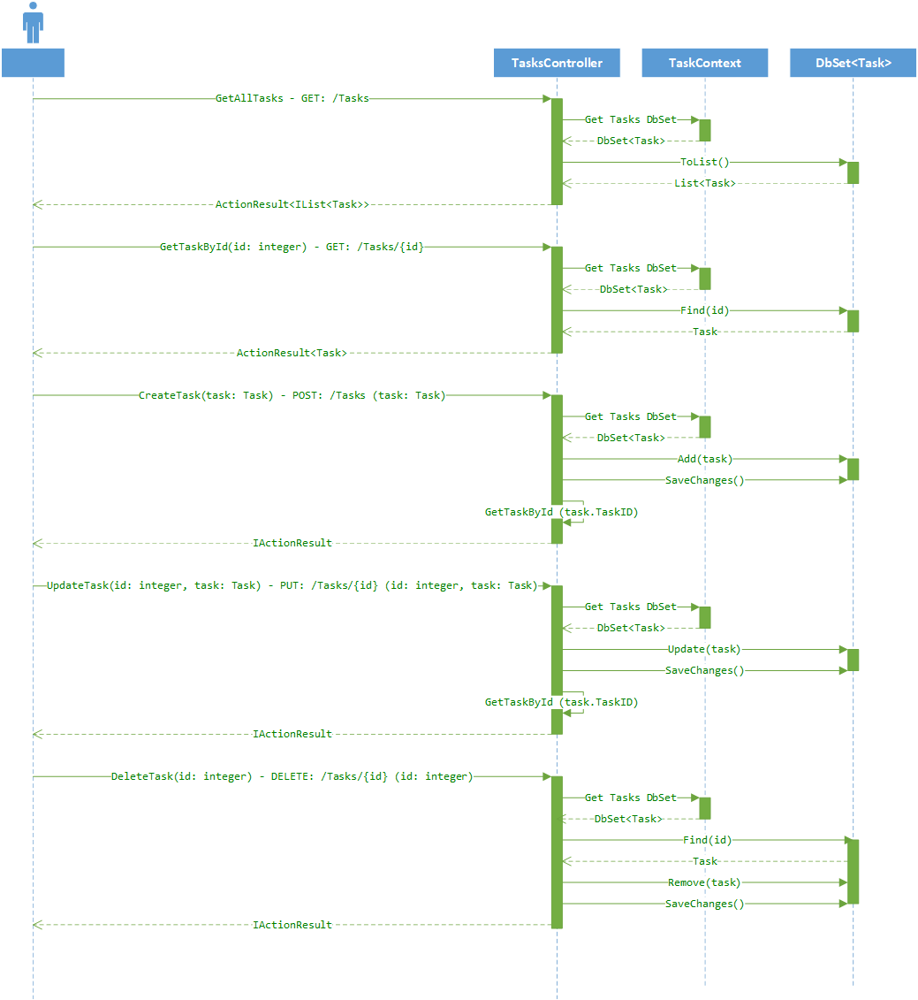

# Web Api for *FSD Capsule Task Manager*

## Introduction 
This is the Web Api for adding, deleting, updating and retrieving *Tasks*.

## Endpoints
This channel service is available at the following endpoints:
 - At localhost: http://localhost:9090/Tasks
 - Development Environment: https://task-manager-api.fsd-capsule-dev.com/Tasks
 - Swagger UI: https://task-manager-api.fsd-capsule-dev.com/swagger/
 - Swagger Document: https://task-manager-api.fsd-capsule-dev.com/swagger/v1/swagger.json

## Technologies
List of technologies used in this service are:

 - .Net Core
 - ASP.Net Core
 - Entity Framework
 - XUnit
 - NuGet

## How to use

### Restore the nuget dpendencies
At the root of the project run
```
dotnet restore
```

### Build the code base
At the root of the project run
```
dotnet build
```

### Run tests

At the root of the project run

```
dotnet test
```

### Start the service

From the build output location (Debug or Release folder), run
```
dotnet Fsd.Capsule.TaskManagerApi.dll
```

Or create the docker image and run the image

## Request Structure

### Request for retrieving all tasks
GET https://task-manager-api.fsd-capsule-dev.com/Tasks

### Request for retrieving a task with specific id
GET https://task-manager-api.fsd-capsule-dev.com/Tasks/{id}

### Request for adding a task
POST to https://task-manager-api.fsd-capsule-dev.com/Tasks

```json
{
    "summary": "Create Release Definitions",
    "description": "Create Release Definitions in Azure",
    "startDate": "2018-07-23",
    "endDate": "2018-07-27",
    "priority": 3,
    "status": 0
}
```

### Request for updating a task
PUT to https://task-manager-api.fsd-capsule-dev.com/Tasks/{id}

```json
{
    "$id": "1062",
    "summary": "Another Task Edited",
    "description": "Create Release Definitions in Microsoft Azure",
    "startDate": "2018-07-23",
    "endDate": "2018-07-27",
    "priority": 3,
    "status": 0
}
```

### Request for deleting a task with specific id
DELETE https://task-manager-api.fsd-capsule-dev.com/Tasks/{id}

## Response Structure

### For all Tasks
```json
[
    {
        "$id": "3118",
        "taskID": 1,
        "summary": "Implement Channel Service",
        "description": "Implement Channel Service for the feature which will invoke the factories",
        "startDate": "2018-07-02T00:00:00",
        "endDate": "2018-07-06T00:00:00",
        "priority": 2,
        "status": 0
    },
    ...
    {
        "$id": "3130",
        "taskID": 14,
        "summary": "Create Release Definitions",
        "description": "Create Release Definitions in Microsoft Azure",
        "startDate": "2018-07-23T00:00:00",
        "endDate": "2018-07-27T00:00:00",
        "priority": 3,
        "status": 0
    }
]
```

### For a single Task retrieve and for update
```json
{
    "$id": "3131",
    "taskID": 1,
    "summary": "Implement Channel Service",
    "description": "Implement Channel Service for the feature which will invoke the factories",
    "startDate": "2018-07-02T00:00:00",
    "endDate": "2018-07-06T00:00:00",
    "priority": 2,
    "status": 0
}
```

## Sequence Diagram
[](./design/MiddleTierDesign.png)