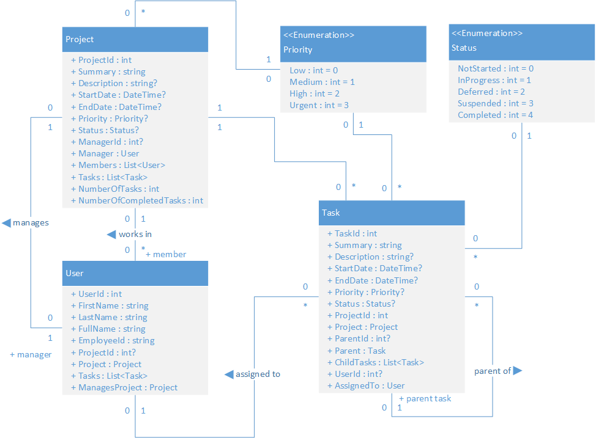

# Web Api for *FSD Project Manager*

## Introduction 
This is the Web Api for adding, deleting, updating and retrieving *Projects*, *Users* and *Tasks*.

## Endpoints
This channel service is available at the following endpoints:
 - At localhost: http://localhost:9090/Tasks
 - Development Environment: https://project-manager-api.fsd-project-manager-dev.com/
 - Swagger UI: https://project-manager-api.fsd-project-manager-dev.com/swagger/
 - Swagger Document: https://project-manager-api.fsd-project-manager-dev.com/swagger/v1/swagger.json

## Technologies
List of technologies used in this service are:

 - .Net Core
 - ASP.Net Core
 - Entity Framework
 - XUnit
 - NuGet

## How to use

### Restore the nuget dpendencies
At the root of the project run
```
dotnet restore
```

### Build the code base
At the root of the project run
```
dotnet build
```

### Run tests

At the root of the project run

```
dotnet test
```

### Publish the project output

At the root of the project run

```
dotnet publish -c Release
```

### Start the service

From the build output location (Debug or Release folder), run
```
dotnet Fsd.ProjectManager.Api.dll
```

Or create the docker image

```
docker build -t project-manager-api .
```

and run the image

```
docker run -p 9090:9090 project-manager-api
```

### Use the batch file to build
You can also use the batch file `Build.bat` to build and package the project. However please note that the project is supposed to run in Kubernetes after the Kubernetes configurations and environment variables from the `K8SConfig` directory are applied.

### Use the Jenkins Pipeline to build

Alternatively you can use the Jenkins (http://localhost:8080) pipeline in project `Fsd.ProjectManager.Api` which automatically triggers the build when any change happens on the Git repository.

## Class Diagram
[](./design/Fsd.ProjectManager.Api-Design-Class-Diagram.png)

## Database
[](./design/Fsd.ProjectManager.Api-Design-Database.png)

## Working with Projects

### Request Structure

#### Request for retrieving all projects
GET https://project-manager-api.fsd-project-manager-dev.com/Project

#### Request for retrieving a project with specific id
GET https://project-manager-api.fsd-project-manager-dev.com/Project/{id}

#### Request for retrieving the manager of a project with specific id
GET https://project-manager-api.fsd-project-manager-dev.com/Project/{id}/Manager

#### Request for retrieving the tasks of a project with specific id
GET https://project-manager-api.fsd-project-manager-dev.com/Project/{id}/Tasks

#### Request for retrieving the members of a project with specific id
GET https://project-manager-api.fsd-project-manager-dev.com/Project/{id}/Members

#### Request for adding a project
POST to https://project-manager-api.fsd-project-manager-dev.com/Project

```json
{
    "summary": "The Ultimate Machine",
    "description": "To implement a Turning Machine that can pass the Turing Test",
    "startDate": "2019-01-01T00:00:00",
    "endDate": "2019-12-31T00:00:00",
    "priority": 0,
    "status": "NotStarted",
    "managerId": 16
}
```

#### Request for updating a project
PUT to https://project-manager-api.fsd-project-manager-dev.com/Project/{id}

```json
{
    "summary": "The Super Ultimate Machine",
    "description": "To implement a Turning Machine that can pass the Turing Test",
    "startDate": "2019-01-01T00:00:00",
    "endDate": "2019-12-31T00:00:00",
    "priority": 3,
    "status": "InProgress",
    "managerId": 16
}
```

#### Request for deleting a project with specific id
DELETE https://project-manager-api.fsd-project-manager-dev.com/Project/{id}

### Response Structure

#### For all Projects
```json
[
    {
        "$id": "13",
        "projectId": 1,
        "summary": "The Machine",
        "description": "To implement a Turning Machine that can pass the Turing Test",
        "startDate": "2018-01-01T00:00:00",
        "endDate": "2018-12-31T00:00:00",
        "priority": 3,
        "status": "InProgress",
        "managerId": 14,
        "numberOfTasks": 0,
        "numberOfCompletedTasks": 0,
        "timestamp": "AAAAAAAANrU="
    },
    {
        "$id": "14",
        "projectId": 3,
        "summary": "The Ultimate Machine",
        "description": "To implement a Turning Machine that can pass the Turing Test",
        "startDate": "2019-01-01T00:00:00",
        "endDate": "2019-12-31T00:00:00",
        "priority": 3,
        "status": "NotStarted",
        "managerId": 16,
        "numberOfTasks": 0,
        "numberOfCompletedTasks": 0,
        "timestamp": "AAAAAAAANrY="
    }
]
```

#### For a single Project retrieve and for update
```json
{
    "$id": "15",
    "projectId": 1,
    "summary": "The Machine",
    "description": "To implement a Turning Machine that can pass the Turing Test",
    "startDate": "2018-01-01T00:00:00",
    "endDate": "2018-12-31T00:00:00",
    "priority": 3,
    "status": "InProgress",
    "managerId": 14,
    "timestamp": "AAAAAAAANrU="
}
```

## Sequence Diagram
[](./design/Fsd.ProjectManager.Api-Design-Projects-Sequence.png)

## Working with Tasks

### Request Structure

#### Request for retrieving all tasks
GET https://project-manager-api.fsd-project-manager-dev.com/Tasks

#### Request for retrieving a task with specific id
GET https://project-manager-api.fsd-project-manager-dev.com/Tasks/{id}

#### Request for retrieving the project of a task with specific id
GET https://project-manager-api.fsd-project-manager-dev.com/Tasks/{id}/Project

#### Request for retrieving the assigned to user of a task with specific id
GET https://project-manager-api.fsd-project-manager-dev.com/Tasks/{id}/AssignedTo

#### Request for retrieving the parent of a task with specific id
GET https://project-manager-api.fsd-project-manager-dev.com/Tasks/{id}/Parent

#### Request for adding a task
POST to https://project-manager-api.fsd-project-manager-dev.com/Tasks

```json
{
    "summary": "Summary of the Task",
    "description": "Description of the Task",
    "startDate": "2018-09-23",
    "endDate": "2018-09-27",
    "priority": 0,
    "status": "NotStarted",
    "projectId": 1
}
```

#### Request for updating a task
PUT to https://task-manager-api.fsd-capsule-dev.com/Tasks/{id}

```json
{
    "summary": "Updated task",
    "description": "Description of the Task",
    "startDate": "2018-07-23",
    "endDate": "2018-07-27",
    "priority": 3,
    "status": "InProgress",
    "projectId": 1
}
```

#### Request for deleting a task with specific id
DELETE https://task-manager-api.fsd-capsule-dev.com/Tasks/{id}

### Response Structure

#### For all Tasks
```json
[
    {
        "$id": "28",
        "taskId": 1,
        "summary": "Implement Channel Service",
        "description": "Implement Channel Service for the feature which will invoke the factories",
        "startDate": "2018-09-02T00:00:00",
        "endDate": "2018-09-06T00:00:00",
        "priority": 3,
        "status": "NotStarted",
        "projectId": 1,
        "userId": 10,
        "timestamp": "AAAAAAAAB+4="
    },
    {
        "$id": "29",
        "taskId": 2,
        "summary": "Implement Front End Service",
        "description": "Implement Front End Service for the feature which will invoke the Channel Service",
        "startDate": "2018-09-09T00:00:00",
        "endDate": "2018-09-13T00:00:00",
        "priority": 3,
        "status": "NotStarted",
        "projectId": 1,
        "userId": 11,
        "timestamp": "AAAAAAAAB+8="
    },
    ...
    {
        "$id": "39",
        "taskId": 12,
        "summary": "Create CI/CD pipeline for Front End",
        "projectId": 1,
        "parentId": 3,
        "userId": 9,
        "timestamp": "AAAAAAAAB/k="
    }
]
```

#### For a single Task retrieve and for update
```json
{
    "$id": "40",
    "taskId": 1,
    "summary": "Implement Channel Service",
    "description": "Implement Channel Service for the feature which will invoke the factories",
    "startDate": "2018-09-02T00:00:00",
    "endDate": "2018-09-06T00:00:00",
    "priority": 3,
    "status": "NotStarted",
    "projectId": 1,
    "userId": 10,
    "timestamp": "AAAAAAAAB+4="
}
```

## Sequence Diagram
[](./design/Fsd.ProjectManager.Api-Design-Tasks-Sequence.png)

## Working with Users

### Request Structure

#### Request for retrieving all users
GET https://project-manager-api.fsd-project-manager-dev.com/Users

Response can be filtered with the Employee Id query parameter:

GET https://project-manager-api.fsd-project-manager-dev.com/Users?employeeId=100000

#### Request for retrieving a user with specific id
GET https://project-manager-api.fsd-project-manager-dev.com/Users/{id}

#### Request for retrieving the tasks assigned to a project with specific id
GET https://project-manager-api.fsd-project-manager-dev.com/Users/{id}/Tasks

#### Request for retrieving the project of an user with specific id
GET https://project-manager-api.fsd-project-manager-dev.com/Users/{id}/Project

#### Request for retrieving the project managed by an user with specific id
GET https://project-manager-api.fsd-project-manager-dev.com/Users/{id}/ManagedProject

#### Request for adding a user
POST to https://project-manager-api.fsd-project-manager-dev.com/Users

```json
{
    "firstName": "Somnath",
    "lastName": "Mukherjee",
    "employeeId": "100015"
}
```

#### Request for updating a user
PUT to https://project-manager-api.fsd-project-manager-dev.com/Users/{id}

```json
{
    "firstName": "Somnath",
    "lastName": "Mukherjee",
    "employeeId": "100015",
    "projectId": 1
}
```

#### Request for deleting a user with specific id
DELETE https://project-manager-api.fsd-project-manager-dev.com/Users/{id}

### Response Structure

#### For all Users
```json
[
    {
        "$id": "75",
        "userId": 1,
        "firstName": "Alan",
        "lastName": "Turiing",
        "fullName": "Turiing, Alan",
        "employeeId": "100000",
        "projectId": 1,
        "timestamp": "AAAAAAAAB+A="
    },
    ...
    {
        "$id": "90",
        "userId": 19,
        "firstName": "Somnath",
        "lastName": "Mukherjee",
        "fullName": "Mukherjee, Somnath",
        "employeeId": "100015",
        "projectId": 1,
        "timestamp": "AAAAAAAAhNM="
    }
]
```

#### For a single User retrieve and for update
```json
{
    "$id": "91",
    "userId": 2,
    "firstName": "Donald",
    "lastName": "Knuth",
    "employeeId": "100001",
    "projectId": 1,
    "timestamp": "AAAAAAAAB+E="
}
```

## Sequence Diagram
[](./design/Fsd.ProjectManager.Api-Design-Users-Sequence.png)